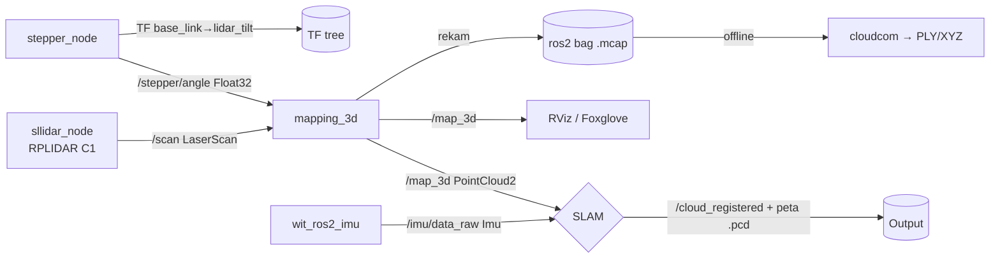

# Panduan Sistem — 3D LiDAR Scanner (Tilting 2D LiDAR + IMU)

> Dokumentasi teknis proyek skripsi. Menjelaskan arsitektur, cara build, cara
> menjalankan di Raspberry Pi, detail bagian LiDAR (fokus riset), dan catatan
> perbaikan struktur.
>
> Repo: `Project-TD-Skripsi-Pak-Eko` · Platform: **Raspberry Pi 5** · ROS 2

---

## 1. Ringkasan Proyek

Sistem ini membangun **peta titik 3D (point cloud)** dari sebuah **LiDAR 2D
(RPLIDAR C1)** yang **dimiringkan/diputar secara kontinu oleh motor stepper**.
Karena LiDAR 2D hanya memindai satu bidang datar, dengan memiringkannya
perlahan lewat sumbu putar (via belt/gear 30T→60T), bidang pindai tersebut
menyapu seluruh ruang → terbentuk data 3D.

Data LiDAR digabungkan dengan **sudut stepper** (untuk mengetahui orientasi
bidang pindai) dan **IMU** (untuk odometri/SLAM), lalu diproses menjadi peta 3D
oleh salah satu algoritma SLAM (**FAST-LIO2** atau **RTAB-Map**).

**Alur singkat:** `LiDAR 2D + sudut motor → point cloud 3D (/map_3d) → SLAM → peta .pcd`

---

## 2. Arsitektur Sistem

### Hardware
| Komponen | Detail | Antarmuka |
|---|---|---|
| Compute | Raspberry Pi 5 | `GPIOCHIP = 4` |
| LiDAR | SLAMTEC **RPLIDAR C1** (2D) | USB serial `/dev/ttyUSB1`, 460800 baud, 12 Hz |
| IMU | **WIT** IMU (mis. WT901) | USB serial `/dev/ttyUSB0`, 9600 baud |
| Motor | Stepper (NEMA + driver STEP/DIR/EN) | GPIO **STEP=17, DIR=27, EN=22** |
| Transmisi | Pulley motor **30T** → pulley LiDAR **60T** | rasio 0.5 (LiDAR ½ kecepatan motor) |

### Alur data (ROS 2)



---

## 3. Struktur Folder & Package

Workspace: `~/ros2_ws` (di Raspi) · source ada di `ros2_ws/src/`.

| Package | Bahasa / build | Peran |
|---|---|---|
| **stepper_controller** | Python (`ament_python`) | Orkestrator: node motor, node mapping (fusi scan+sudut), launch file utama |
| **sllidar_ros2** | C++ (`ament_cmake`) | Driver resmi SLAMTEC RPLIDAR → publish `/scan` |
| **wit_ros2_imu** | Python (`ament_python`) | Driver IMU WIT → publish `/imu/data_raw` |
| **spark-fast-lio** | C++ (`ament_cmake`) | SLAM **FAST-LIO2** (executable `spark_lio_mapping`) |
| **cloudcom** | Skrip Python berdiri sendiri | Konversi rekaman `.mcap` → point cloud (PLY/XYZ) offline. Punya `.venv` sendiri |

### Isi penting `stepper_controller`
```
stepper_controller/
├── launch/
│   ├── mapping_system.launch.py   # "sekali jalan": IMU+LiDAR+stepper+mapping+foxglove
│   └── stepper_launch.py          # hanya node motor
├── stepper_controller/
│   ├── stepper_node.py            # driver motor (GPIO) + publish sudut + TF
│   ├── mapping_3d.py              # fusi scan+sudut → /map_3d (mode Full-Sweep) ← default
│   ├── mapping_3d_fastlio.py      # varian Full-Sweep untuk input FAST-LIO
│   ├── mapping_3d_fastlio_scan.py # varian Per-Scan (~10Hz) untuk input FAST-LIO
│   └── mapping_3d_old.py          # versi lama (arsip)
├── stepper_test.py                # skrip kalibrasi motor manual (BUKAN node ROS)
└── setup.py                       # daftar executable (entry_points)
```

---

## 4. Prasyarat (yang harus ada di Raspberry Pi)

> Konfirmasi dulu distro ROS 2 yang terpasang (kemungkinan **Humble** atau
> **Jazzy**). Sesuaikan `<distro>` di perintah `source /opt/ros/<distro>/setup.bash`.

**Paket sistem / ROS:**
- ROS 2 (rclpy, tf2_ros, sensor_msgs, geometry_msgs, std_msgs, nav_msgs)
- `ros-<distro>-foxglove-bridge` — untuk visualisasi remote
- `ros-<distro>-rtabmap-odom` (bila memakai jalur RTAB-Map)
- Dependensi C++ `spark-fast-lio`: PCL, Eigen, `pcl_ros`, `pcl_conversions`, `tf2_eigen`

**Python (untuk node mapping):**
- `numpy`, `scipy` (dipakai `scipy.spatial.transform.Rotation`)
- `lgpio` (GPIO Raspberry Pi 5)

**Sistem / izin:**
- User masuk grup `dialout` agar bisa akses `/dev/ttyUSB*` tanpa sudo
- (Disarankan) **udev rule** agar penamaan port stabil — lihat §12

---

## 5. Cara Build

```bash
cd ~/ros2_ws
source /opt/ros/<distro>/setup.bash      # mis. humble / jazzy

# Build semua package
colcon build --symlink-install

# ATAU build satu package saja (lebih cepat saat iterasi kode Python)
colcon build --symlink-install --packages-select stepper_controller

# Setelah build, WAJIB source overlay-nya:
source install/setup.bash
```
> Dengan `--symlink-install`, perubahan file **Python** langsung berlaku tanpa
> build ulang. Perubahan pada C++ (`sllidar_ros2`, `spark-fast-lio`) tetap perlu
> `colcon build`.

---

## 6. Cara Menjalankan

> **Selalu** jalankan `source install/setup.bash` di setiap terminal baru sebelum
> perintah `ros2 launch/run`.

### 6.a. Cara cepat — satu perintah (semua sekaligus)
Menjalankan IMU + LiDAR + stepper + node mapping + foxglove sekaligus:
```bash
source install/setup.bash
ros2 launch stepper_controller mapping_system.launch.py
```

### 6.b. Cara manual — per terminal (untuk debugging)
```bash
# Terminal 1 — IMU
ros2 launch wit_ros2_imu rviz_and_imu.launch.py
# Terminal 2 — LiDAR
ros2 launch sllidar_ros2 sllidar_c1_launch.py
# Terminal 3 — Motor stepper
ros2 launch stepper_controller stepper_launch.py
# Terminal 4 — Node mapping (fusi → /map_3d)
ros2 run stepper_controller mapping_3d
# Terminal 5 — Visualisasi
rviz2
```

### 6.c. Visualisasi remote (dari laptop) — Foxglove
Di Raspi:
```bash
ros2 launch foxglove_bridge foxglove_bridge_launch.xml
```
Lalu di laptop, buka Foxglove Studio → connect ke `ws://<IP_RASPI>:8765`.
> Di RViz/Foxglove, agar point cloud menumpuk jadi peta utuh, set
> **Decay Time** pada display PointCloud2 ke nilai besar (mis. `10000`).

### 6.d. Jalur SLAM A — FAST-LIO2 (spark-fast-lio)
FAST-LIO mengonsumsi `/map_3d` (sebagai LiDAR) + `/imu/data_raw`, memakai config
khusus `sllidar_stepper.yaml`. **Catatan:** belum ada launch file yang otomatis
memuat config ini (lihat §12 — rekomendasi membuatnya). Jalankan node-nya dengan
config eksplisit:
```bash
ros2 run spark_fast_lio spark_lio_mapping --ros-args \
  --params-file $(ros2 pkg prefix spark_fast_lio)/share/spark_fast_lio/config/sllidar_stepper.yaml \
  -r lidar:=/map_3d -r imu:=/imu/data_raw
```
Saat node ditekan `Ctrl+C`, karena `pcd_save_en: true`, seluruh peta diekspor ke
file `.pcd`.

### 6.e. Jalur SLAM B — RTAB-Map (icp_odometry)
```bash
# Terminal 1 — sistem utama
source ~/ros2_ws/install/setup.bash
ros2 launch stepper_controller mapping_system.launch.py

# Terminal 2 — odometri ICP dari point cloud
source ~/ros2_ws/install/setup.bash
ros2 run rtabmap_odom icp_odometry --ros-args \
  -r scan_cloud:=/map_3d \
  -r scan:=/dummy_scan
```

### 6.f. Rekam & putar ulang data (bag)
```bash
# Rekam (format mcap)
ros2 bag record \
  /scan /imu/data_raw /stepper/angle /map_3d /odom /tf \
  -s mcap -o ~/bags/test_lab_01

# Putar ulang
source ~/ros2_ws/install/setup.bash
ros2 bag play ~/bags/test_lab_01
```

### 6.g. Atur kecepatan putar motor
Parameter `data` = **delay per step (detik)**. **Makin kecil = makin cepat.**
```bash
# Sangat lambat
ros2 topic pub /stepper/speed std_msgs/msg/Float32 "data: 0.05"  --once
# Lambat
ros2 topic pub /stepper/speed std_msgs/msg/Float32 "data: 0.01"  --once
# Normal
ros2 topic pub /stepper/speed std_msgs/msg/Float32 "data: 0.005" --once
# Cepat
ros2 topic pub /stepper/speed std_msgs/msg/Float32 "data: 0.002" --once
```
Kontrol lain:
```bash
ros2 topic pub /stepper/enable    std_msgs/msg/Bool "data: false" --once  # stop motor
ros2 topic pub /stepper/direction std_msgs/msg/Bool "data: true"  --once  # arah putar
```

### 6.h. Konfigurasi RViz (sesuai GUIDE)
Display yang perlu diatur di RViz agar peta 3D tampil (dari GUIDE halaman 2):
| Setting / Display | Nilai |
|---|---|
| **Fixed Frame** | `map` |
| Background Color | `48; 48; 48` |
| Frame Rate | `30` |
| **Grid** | ✅ aktif |
| **PointCloud2** (topik `/map_3d`) | ✅ aktif |
| LaserScan | ⬜ nonaktif |
| Imu | ⬜ nonaktif |
| PointStamped | ⬜ nonaktif |
| TF | ⬜ nonaktif |

> Catatan GUIDE: dengan Fixed Frame `map`, sempat muncul *Global Status: Error —
> "Frame [map] does not exist"* selama SLAM/odometri belum mem-publish frame `map`.
> Ini normal sebelum jalur SLAM (FAST-LIO/RTAB-Map) aktif; untuk sekadar melihat
> sapuan mentah, Fixed Frame bisa sementara diarahkan ke `base_link`/`lidar_tilt`.
> Ingat set **Decay Time** PointCloud2 ke nilai besar (mis. `10000`) agar menumpuk.

---

## 7. Daftar Topik ROS

| Topik | Tipe | Publisher | Konsumen |
|---|---|---|---|
| `/scan` | `sensor_msgs/LaserScan` | sllidar_node | mapping_3d |
| `/imu/data_raw` | `sensor_msgs/Imu` | wit_ros2_imu | FAST-LIO |
| `/stepper/angle` | `std_msgs/Float32` (radian) | stepper_node | mapping_3d |
| `/stepper/steps` | `std_msgs/Int32` | stepper_node | monitoring |
| `/stepper/status` | `std_msgs/Bool` | stepper_node | monitoring |
| `/stepper/speed` | `std_msgs/Float32` (delay/step) | *(user)* | stepper_node |
| `/stepper/enable` | `std_msgs/Bool` | *(user)* | stepper_node |
| `/stepper/direction` | `std_msgs/Bool` | *(user)* | stepper_node |
| `/map_3d` | `sensor_msgs/PointCloud2` | mapping_3d | SLAM, RViz, bag |
| **TF** | `base_link → lidar_tilt` | stepper_node | semua |

---

## 8. 🔬 Bagian LiDAR (fokus riset)

### 8.a. Mekanisme
LiDAR 2D **RPLIDAR C1** memindai 360° pada **satu bidang** (~12 Hz). Motor stepper
memiringkan seluruh unit LiDAR mengelilingi **sumbu X** (frame `lidar_tilt`).
Karena bidang pindai ikut miring seiring waktu, kumpulan scan 2D → membentuk 3D.

### 8.b. Matematika sudut (di `stepper_node.py`)
```
steps_per_rev = 1600            # microstep motor per 1 putaran motor
gear_ratio    = 30/60 = 0.5     # LiDAR berputar ½ kecepatan motor

motor_angle = (current_step / 1600) × 360°
lidar_angle = (motor_angle × 0.5) mod 360°     # ← ini yang di-publish ke /stepper/angle (radian)
```
➡️ **1 putaran penuh LiDAR (360°) = 3200 step motor** (motor harus berputar 720°).

> ⚠️ **Catatan akurasi dokumen kode:** komentar di `stepper_node.py` menyebut
> *"400 motor steps to complete one 360-degree Lidar rotation"* — angka ini
> **tidak konsisten** dengan rumus di kodenya (yang menghasilkan 3200). Perlu
> diverifikasi mana yang benar terhadap perilaku fisik motor sebenarnya. Ini
> relevan langsung untuk kalibrasi risetmu.

### 8.c. Transformasi 2D → 3D (di `mapping_3d.py`)
Untuk tiap berkas (ray) LiDAR:
```python
x = distance * cos(scan_angle)      # titik pada bidang LiDAR
y = distance * sin(scan_angle)
z = 0
# lalu diputar mengikuti sudut stepper (sumbu X):
point_3d = Rotation.from_euler('x', -servo_angle).apply([x, y, z])
```
Sudut stepper untuk tiap ray di-**interpolasi terhadap waktu** (`np.interp`) supaya
sinkron dengan saat ray itu terekam (LiDAR & motor jalan bersamaan).

> ⚠️ **Poin penting untuk diteliti (kemungkinan transform ganda):**
> `mapping_3d.py` sudah **memutar titik dengan `-servo_angle`** lalu memberi
> `frame_id = "lidar_tilt"`. Padahal `stepper_node.py` **juga** memancarkan TF
> `base_link→lidar_tilt` yang memutar `+servo_angle`. Jika konsumen memakai TF
> (mis. RViz dengan Fixed Frame `map`/`base_link`), titik bisa **terputar dua
> kali**. Ini kandidat kuat sumber error mapping — layak diverifikasi sebagai
> bagian riset (apakah harusnya frame `lidar_tilt` diganti `base_link`, atau
> rotasi di kode dihapus, tergantung siapa konsumennya).

### 8.d. Parameter LiDAR yang bisa di-tune
| Di file | Parameter | Nilai kini | Efek |
|---|---|---|---|
| `sllidar_c1_launch.py` | `serial_port` | `/dev/ttyUSB1` | port LiDAR |
| `sllidar_c1_launch.py` | `serial_baudrate` | `460800` | wajib untuk C1 |
| `sllidar_c1_launch.py` | `scan_frequency` | `12.0` | Hz pindai — makin tinggi, makin rapat sepanjang tilt |
| `sllidar_c1_launch.py` | `scan_mode` | `Standard` | mode pemindaian |
| `stepper_launch.py` | `steps_per_rev` | `1600` | resolusi microstep |
| `stepper_launch.py` | `delay` | `0.001` | kecepatan tilt awal |
| `mapping_3d.py` | ambang deteksi 1 putaran | `>5.5 → <0.5` rad | kapan 1 sweep dianggap selesai |

> **Trade-off riset kerapatan 3D:** kombinasi `scan_frequency` (LiDAR) vs
> kecepatan tilt (`/stepper/speed`) menentukan kerapatan titik antar-lapisan.
> Tilt lambat + scan cepat = peta rapat tapi lama; tilt cepat = peta jarang.

---

## 9. Tiga Varian Node Mapping — pakai yang mana?

| Node | Mode publish `/map_3d` | Kapan dipakai |
|---|---|---|
| **`mapping_3d`** (default) | **Full-Sweep** — akumulasi 1 putaran penuh (360° tilt) lalu publish sekaligus | Visualisasi peta per-sapuan, baseline |
| **`mapping_3d_fastlio`** | Full-Sweep, disiapkan sebagai input FAST-LIO | Uji FAST-LIO per-sweep |
| **`mapping_3d_fastlio_scan`** | **Per-Scan** — publish tiap 1 pesan LaserScan (~10 Hz), timestamp relatif 0–0.073 s | Uji FAST-LIO frekuensi tinggi (lebih mirip LiDAR asli) |

Format `PointCloud2` (semua varian): field `x,y,z,intensity,ring,time`,
`point_step=24`, frame `lidar_tilt`.

---

## 10. Konfigurasi FAST-LIO (`sllidar_stepper.yaml`)

Parameter kunci (file: `spark-fast-lio/spark_fast_lio/config/sllidar_stepper.yaml`):
| Parameter | Nilai | Arti |
|---|---|---|
| `lid_topic` | `/map_3d` | LiDAR input = point cloud hasil fusi |
| `imu_topic` | `/imu/data_raw` | sumber IMU |
| `lidar_type` | `2` (Velodyne) | format point cloud yang diharapkan |
| `filter_size_map` | `0.05` | ukuran voxel — kecil = peta rapat/tajam |
| `point_filter_num` | `1` | tiap titik dipakai (tak dibuang) |
| `pcd_save_en` | `true` | simpan `.pcd` saat `Ctrl+C` |
| `extrinsic_T/R` | identitas | offset IMU↔LiDAR (kalibrasi bila perlu) |

Istilah diagnostik dari log FAST-LIO (rangkuman `README_12_JULY.md`):
- **`feats_down`** — jumlah titik setelah filter voxel. Terlalu kecil (mis. 92) = terlalu agresif membuang; besar (mis. 11.731) = rapat/tajam.
- **`effective`** — titik yang menemukan pasangan bidang di peta IKD-Tree. **`effective = 0` = gagal koreksi posisi** (drift / voxel terlalu besar).

---

## 11. Pemrosesan Offline — `cloudcom/mcaptopc.py`

Mengubah rekaman `.mcap` (topik `/map_3d` diprioritaskan) menjadi **PLY + XYZ +
PNG** untuk dibuka di CloudCompare. Tidak butuh instalasi ROS.
```bash
cd ~/ros2_ws/src/cloudcom
source .venv/bin/activate          # butuh: numpy, mcap, mcap-ros2, matplotlib
python mcaptopc.py                 # jalankan dari folder berisi file .mcap
```
Output: `<nama>_pointcloud.ply`, `.xyz`, `_scan_viz.png`.

---

## 12. 🧹 Rekomendasi Perbaikan Struktur (usulan — belum dieksekusi)

Struktur workspace saat ini agak berantakan. Berikut usulan perbaikan beserta
alasannya. **Aku belum menjalankan apa pun di bawah ini — tunggu persetujuanmu.**

1. **File nyasar di root `src/`** — ada `mapping_3d.py`, `scan_to_pointcloud.py`,
   `scan_to_pointcloud3d.py`, `README.md`, folder `data_saya.mcap` yang duduk
   langsung di `src/` (bukan di dalam package). `mapping_3d.py` di sini duplikat
   dari yang di dalam `stepper_controller`. → Sebaiknya diarsipkan ke folder
   `archive/` atau dihapus setelah dipastikan tak terpakai.

2. **Build artifact bersarang di dalam `src/`** — ada `src/build/`, `src/install/`,
   `src/log/` (dan `wit_ros2_imu/build|install|log`). Ini sisa build yang salah
   direktori. Aman dihapus (regenerable, sudah masuk `.gitignore`); build yang
   benar hanya di `~/ros2_ws/{build,install,log}`.
   ```bash
   rm -rf src/build src/install src/log \
          src/wit_ros2_imu/build src/wit_ros2_imu/install src/wit_ros2_imu/log
   ```

3. **`cloudcom/.venv` masuk git** — `git status` menampilkan file `.venv` ter-track.
   Virtualenv tidak boleh di-commit. → tambahkan `.venv/` ke `.gitignore` lalu
   `git rm -r --cached src/cloudcom/.venv`.

4. **FAST-LIO belum punya launch file** — config `sllidar_stepper.yaml` harus
   dipanggil manual. → Buat `sllidar_stepper.launch.yaml` di
   `spark-fast-lio/.../launch/` yang memuat config + remap `lidar:=/map_3d`,
   `imu:=/imu/data_raw` + RViz, meniru pola `mapping_vbr_colosseo.launch.yaml`.

5. **Nama launch file bercelah** — `sllidar_a2m12_launch .py` mengandung spasi
   sebelum `.py`. → rename tanpa spasi (kosmetik, tidak mendesak).

6. **Metadata package** — `package.xml` `stepper_controller` masih `description`,
   `license`, `maintainer` = `TODO`. → isi agar rapi untuk laporan skripsi.

---

## 13. Troubleshooting & Catatan

- **`/dev/ttyUSB0` vs `ttyUSB1` tertukar** — urutan tergantung urutan colok USB.
  IMU diharapkan di `ttyUSB0`, LiDAR di `ttyUSB1`. Jika mapping/IMU tak jalan, cek
  `ls /dev/ttyUSB*` dan `dmesg | grep tty`. **Solusi permanen:** buat udev rule
  berdasarkan serial device agar nama port tetap (paket `wit_ros2_imu` sempat
  punya `imu_usb.rules` + `bind_usb.sh` sebagai contoh).
- **`Segmentation fault` saat pakai Hardware PWM stepper** — jangan pakai
  `lgpio.tx_pwm` pada `STEP_PIN=17`; di chip RP1 Raspberry Pi 5 hanya pin
  **12, 13, 18, 19** yang punya Hardware PWM. Kode saat ini sengaja memakai
  `time.sleep` (software timing) karena alasan ini. (lihat `README_12_JULY.md`)
- **Permission `/dev/ttyUSB*`** — `sudo usermod -aG dialout $USER` lalu logout/login.
- **Motor tidak menahan (torsi)** — `EN_PIN` aktif-LOW: `0` = enable/menahan,
  `1` = disable.
- **Point cloud tak menumpuk di RViz** — naikkan **Decay Time** display PointCloud2.

---

## 14. Referensi Cepat (cheat-sheet)

```bash
# Build + source
cd ~/ros2_ws && colcon build --symlink-install && source install/setup.bash

# Jalankan semua
ros2 launch stepper_controller mapping_system.launch.py

# Atur kecepatan (kecil=cepat)
ros2 topic pub /stepper/speed std_msgs/msg/Float32 "data: 0.005" --once

# Rekam
ros2 bag record /scan /imu/data_raw /stepper/angle /map_3d /odom /tf -s mcap -o ~/bags/test_lab_01

# Cek topik & TF
ros2 topic list ; ros2 topic hz /map_3d ; ros2 run tf2_tools view_frames
```

*Dokumen ini dibuat dari analisis kode. Bila ada perilaku di lapangan yang
berbeda dari deskripsi di sini (mis. jumlah step per putaran, atau soal transform
ganda di §8.c), itu justru titik-titik yang paling menarik untuk risetmu.*
